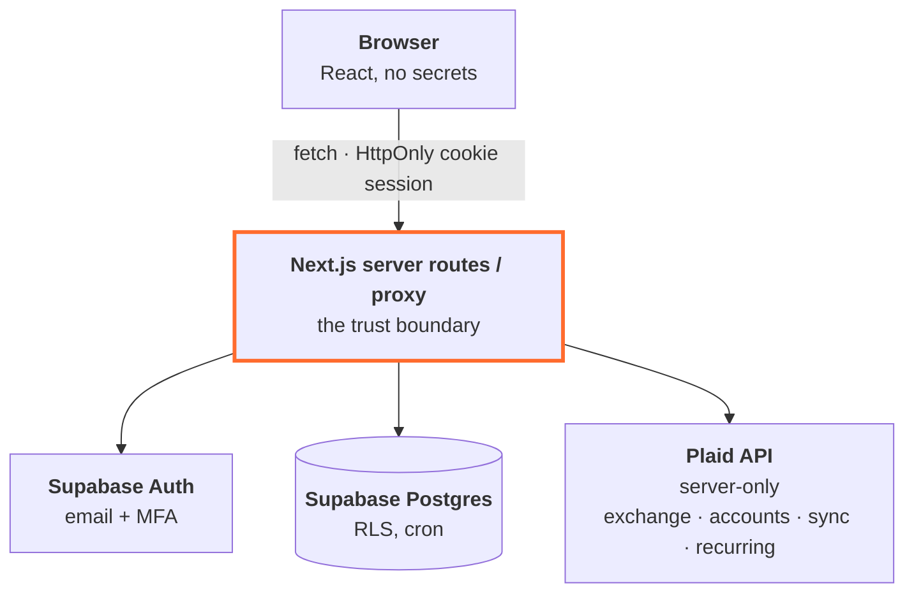

# FundFlow

A secure, personal AI-ready finance app. Connect your bank accounts and credit
cards through **Plaid**, pull and categorize transactions, detect recurring
subscriptions, and see spending insights on a dashboard — spending-vs-income
trend lines, a category donut, diverging cash-flow columns, stat tiles with
sparklines and month-over-month deltas (all server-rendered SVG, no chart
library, CSP-safe). A filterable **transactions ledger** (`/transactions`)
covers search, month, and account views. Built for **1-2 users** (personal
use), deployed on **Vercel + Supabase**.

## Features

- **Transactions** (`/transactions`) — searchable ledger with month/account filters, editable categories and merchant names, transaction **splits** with `50/50`, `1/3`, and `1/4` presets, a receipt inbox (`/transactions/receipts`), **scheduled one-off entries** (rent on the 25th, a savings transfer on the 1st — projected into the forecast and bill calendar now, materialized in the ledger by the daily sync), **transfer linking** review (pair the outflow and inflow of one move between your own accounts so both sides net out of spending), and merchant **brand logos** in every list.
- **Smart rules** (Settings) — keyword, merchant, account, and ReDoS-guarded regex rules with amount conditions that set display name, category, and tags on incoming transactions. Rules can be applied **retroactively** to up to 5,000 historical transactions through a dry-run preview before anything is written.
- **Recurring & subscriptions** (`/recurring`) — Plaid recurring streams (plus locally inferred ones) with **price-spike alerts** that surface subscription increases and their annualized cost.
- **Budgets** (`/budget`), **Goals** (`/goals`), and **Debt payoff** (`/debt`) — category budgets with household/horizon scoping, **copy last month** and **saved templates** (both with explicit merge/overwrite when the month already has envelopes), savings and payoff goals (with liability accounts that lack a goal flagged), and payoff planning.
- **Cash flow & reports** (`/cash-flow`, `/reports`) — inflow/outflow views and income/expense report breakdowns over custom date ranges.
- **Tax year CSV** (Settings → Export data) — a calendar year of transactions grouped by curated tax line items (from the tags you assign in the ledger), split-safe, with a per-line-item summary. Data only, not tax advice.
- **Investments** (`/investments`) — holdings, allocation, performance, and top movers from Plaid investment accounts.
- **Account reconciliation** (Accounts → Reconcile) — enter a statement's ending balance, mark its transactions cleared, see cleared/outstanding/the difference, and record an audited balance adjustment when the bank is right.
- **Forecasting** (`/forecasting`) — a **FIRE independence simulator**: month-by-month compounding projection with scheduled life events (windfalls, one-time outlays, ongoing spend changes), safe-withdrawal-rate targets, and progress toward Lean/Standard/Fat/Coast FIRE.
- **Advice** (`/advice`), **monthly review** (`/review`), and a yearly **Wrapped** (`/wrapped`) retrospective.
- **Keyboard shortcuts** — type `g` then a destination key (`d` dashboard, `t` transactions, `b` budget, `c` cash flow, `r` recurring, `g` goals, `f` forecasting, `s` settings), `?` for the cheat sheet, and `Cmd+K` for the command palette. Input fields are exempt and `prefers-reduced-motion` is respected across the UI.

The default path for AI is **export, not upload**.
FundFlow gives you a **privacy-safe CSV or JSON** (merchant, amount, date, category only) to feed to any AI tool you choose, plus an on-demand **PDF summary report**, all from Settings.
Nothing leaves the app on that path.

There is also an **opt-in in-app AI surface**, dark by default and described under [AI](#ai) below.

The monthly encrypted backup can be generated in-app, but restore is currently disabled by default while the provider-synced account restore design is being replaced. FundFlow can also deliver a visual weekly report for the previous Monday through Sunday to the user's signup email. The Monday report includes categorized spending, week-over-week change, top merchants, budget pace, cash flow, and bank and credit card breakdowns, with an expanded PDF attached. It excludes balances, account numbers or masks, and transaction-level detail.

## Stack

- **Frontend + backend:** Next.js 16 (App Router, TypeScript) — one deployable on Vercel.
- **Auth:** Supabase Auth (email + password or **Google sign-in**, optional **TOTP MFA**), cookie sessions via `@supabase/ssr`.
- **Database:** Supabase Postgres with **Row Level Security** on every table.
- **Bank data:** Plaid (`/link/token/create`, `/item/public_token/exchange`, `/transactions/sync`, `/transactions/recurring/get`).
- **Scheduling:** Vercel Cron for daily sync and GitHub Actions for the hourly timezone-aware weekly report check.

## Architecture



- Plaid `client_id`/`secret` and all `access_token`s live **only** in server code.
- The `access_token` is **AES-256-GCM encrypted** before it touches the database.
- The browser only ever reads sanitized finance data, constrained by RLS.

## Security

- **Encrypted tokens at rest** — Plaid access tokens are AES-256-GCM encrypted app-side (`lib/crypto.ts`); the key is `PLAID_TOKEN_ENC_KEY` (never in the DB). **Key rotation** is supported: demote the old key to `PLAID_TOKEN_ENC_KEY_PREVIOUS` and the daily sync transparently re-encrypts every token with the new key.
- **CSRF origin check** — `proxy.ts` rejects mutating `/api` requests whose `Origin` header doesn't match the host (SameSite=Lax cookies are the first layer; server-to-server callers like Plaid webhooks send no Origin and pass).
- **Row Level Security** — every user table enforces `user_id = auth.uid()`; server code also scopes by user (defense in depth). Cross-user access is covered by an integration test.
- **Server-only secrets** — `lib/env.server.ts` is guarded by `server-only`; secrets can never be bundled into client code.
- **MFA** — TOTP via Supabase Auth (enrollable in Settings), **enforced server-side**: `proxy.ts` and `requireUser()` check the session's assurance level (`lib/mfa.ts`), so a password-only (aal1) session for an MFA-enrolled user is redirected to the TOTP prompt and gets 401 from every API.
- **Security headers** (`proxy.ts`) — nonce-based CSP (allows Plaid + Supabase only), `X-Frame-Options`, `X-Content-Type-Options`, `Strict-Transport-Security`, `Referrer-Policy`, `Permissions-Policy`.
- **Rate limiting** — Supabase handles auth limits; a Postgres-backed limiter guards token exchange and refresh (`lib/rate-limit.ts`).
- **Audit logs** — login/connect/exchange/disconnect/refresh/export/delete recorded in `audit_logs` (never tokens or PII).
- **No sensitive logging** — `lib/log.ts` redacts tokens/PII; errors log message/stack only.
- **Prod error hygiene** — generic errors in production, details only in dev (`lib/http.ts`).
- **RBAC** — admin/debug endpoints gated by a `role` column (`requireAdmin`).
- **User-controlled deletion** — "Disconnect bank" removes the Plaid item + its data; "Delete account" removes everything and calls Plaid `/item/remove`.
- **Broken-bank recovery** — `ITEM` webhooks (login required, consent expiring, permission revoked) mark the item, Settings shows a **Reconnect** button (Plaid Link update mode), and the dashboard warns when data is stale (no successful sync in 48h, tracked in `sync_jobs`).
- **Live updates, rate-limit-aware** — open pages re-render every 2 minutes (DB reads only — new webhook-delivered transactions appear as they happen) and auto-pull from Plaid at most **once per 30 minutes**, enforced server-side per user so extra tabs/devices can't multiply API calls; a consumed window degrades to the render-only layer and the manual Refresh button. An "Updated Xm ago" chip shows freshness.
- **Plaid-frugal by design** — sync is cursor-based (each pull fetches only the delta since the stored cursor; history renders from Postgres with zero Plaid calls), auto-pulls skip the slow-moving recurring-streams call (manual Refresh + daily cron cover it), and webhook verification keys are cached by `kid`.
- **History** — new links request Plaid's maximum **730 days** of transactions (`days_requested`); institutions may provide less. From connection onward, FundFlow retains everything in your own database indefinitely, so history only grows.
- **CSV and migration import** (Settings → Import): backfill older years from bank-statement CSVs, or bring a full history over from **Mint, Monarch, or YNAB** with source-account mapping. Auto-detects date/description/amount (or debit/credit) columns, normalizes to the Plaid sign convention, skips rows overlapping the account's Plaid-synced range, and uses deterministic ids so re-importing never duplicates.
- **Notification control** — `/notifications` controls optional weekly reports, daily digests, planning alerts, and delivery timezone. Bank or sync failures and Auth security messages remain enabled.
- **Least privilege** — the browser uses the publishable key (RLS-bound); the secret key is used only in trusted server routes.
- **Offline cache holds no personal data**: the service worker (`public/sw.js`) caches only content-addressed static assets (styles, scripts, fonts, images), and only on a successful response. HTML documents are never cached, because they render per-user financial data and Cache Storage outlives sign-out; navigations are network-only. Nothing is precached, so a cached document can never survive a deploy and reference asset chunks that no longer exist.
- **Dependency scanning** — Dependabot + `npm audit` in CI.

## AI

In-app AI is **off unless you turn it on twice**: the deployment must set
`ANTHROPIC_API_KEY`, and each account must enable it in Settings. Miss either
and `/api/ai/ask` and `/api/ai/receipt` return 503 while `/api/ai/insights`
serves built-in, rule-based summaries computed locally. The feature degrades;
it never breaks.

What crosses the wire is bounded by the same contract as the CSV export:

- **Aggregates only.** Month/category totals and top merchants, capped at 6
  months and 25 merchants (`lib/ai-provider.ts`). Never balances, account
  names, masks, emails, or transaction-level rows.
- **Per-user daily caps** so a retry loop cannot run up a bill: 4 insight
  generations, 10 questions, 10 receipt scans.
- **Provider failures fall back** to the local summaries rather than erroring.

Three routes use it. `/api/ai/insights` writes short "what changed" and
"subscriptions to review" notes. `/api/ai/ask` answers one grounded question
about your own spending, with no chat history or memory. `/api/ai/receipt` is
the one path that uploads content you supply: a receipt photo goes to the
vision model for merchant/amount/date extraction, is matched against a ledger
transaction, and is **never stored**.

If you would rather run with no model access at all, leave `ANTHROPIC_API_KEY`
unset. Everything else in the app works unchanged.

## Setup

### 1. Prerequisites
- Node 20+ and npm
- A Supabase project ([supabase.com](https://supabase.com))
- A Plaid account with Sandbox keys ([dashboard.plaid.com](https://dashboard.plaid.com/developers/keys))

### 2. Environment
Copy `.env.example` to `.env.local` and fill it in:

```bash
cp .env.example .env.local
```

Generate the crypto secrets:
```bash
node -e "console.log('PLAID_TOKEN_ENC_KEY=' + require('crypto').randomBytes(32).toString('base64'))"
node -e "console.log('CRON_SECRET=' + require('crypto').randomBytes(32).toString('hex'))"
```

Get your Supabase URL + **publishable** and **secret** keys from
Project Settings → API Keys. Get Plaid `client_id`/`secret` from the Plaid dashboard.

### 3. Database
Apply every migration in `supabase/migrations/` to your project, including the weekly insights preferences and delivery table. Either:
- **Supabase CLI:** `supabase link --project-ref <ref>` then `supabase db push`, or
- **Dashboard:** run the migration files in filename order through the SQL editor.

### 4. Supabase Auth settings
- For quick local testing, disable "Confirm email" (Auth → Providers → Email), or use the emailed confirmation link (handled by `/auth/callback`).
- MFA (TOTP) is enabled by default on Supabase.

### 4b. Google sign-in (optional, free)
The "Continue with Google" button needs the Google provider enabled once:

1. In [Google Cloud Console](https://console.cloud.google.com) create (or reuse)
   a project → **APIs & Services → Credentials → Create OAuth client ID**
   (type: Web application). Configure the consent screen when prompted — for a
   personal app, leave it in *Testing* and add your own Google accounts as test
   users (no verification, no cost).
2. Add the **authorized redirect URI** shown by Supabase:
   `https://<ref>.supabase.co/auth/v1/callback`.
3. In Supabase → **Auth → Providers → Google**, toggle it on and paste the
   Google client ID + secret.

No app code or env changes are needed — the OAuth redirect lands on
`/auth/callback`, the same code-exchange route the email flow uses, and the
`profiles` row is auto-created by the `handle_new_user` trigger. If you enroll
TOTP, it applies to Google sign-ins too (same AAL2 enforcement).

### 5. Run
```bash
npm install
npm run dev
```
Open http://localhost:3000, sign up, then connect a bank. In **Plaid Sandbox**, use
username `user_good` / password `pass_good`.

## Testing

```bash
npm run test:unit   # the full unit suite: crypto round-trip/tamper, CSV masking,
                    # rules engine, FIRE simulator, keyboard shortcuts, and
                    # component render tests (no external services)
npm test            # also runs integration tests against your Supabase project
```

Integration tests (`tests/integration/`) require `.env.local` and applied
migrations. They verify **cross-user RLS isolation** and **sync idempotency**
(re-applying the same transaction never duplicates). They auto-skip if env is missing.

## Deploy (Vercel)

1. Import the repo in Vercel.
2. Add all `.env.local` vars as Project Environment Variables (Production).
3. Configure `SMTP_HOST`, `SMTP_PORT`, `SMTP_USER`, `SMTP_PASS`, and `SMTP_FROM`. Financial emails never fall back to a public test inbox in production.
4. `vercel.json` keeps the daily sync on Vercel Hobby. The `weekly-report.yml` GitHub Actions workflow checks `/api/cron/weekly-report` hourly so each opted-in user can receive Monday delivery around 8:00 AM in their selected timezone. Add repository secrets `FUNDFLOW_APP_URL` and `CRON_SECRET` before merging.
5. Both schedulers send `Authorization: Bearer $CRON_SECRET`, which each cron route verifies.
6. Vercel Pro can host the hourly trigger instead if you prefer to consolidate schedulers, but Hobby rejects cron expressions that run more than once per day.
7. Switch `PLAID_ENV` to `production` (and use production Plaid keys) when ready
   to connect real banks.

The report delivery row is claimed before rendering and has a unique user and period key, so duplicate cron calls do not send the same completed report twice. To roll back email delivery, disable the GitHub Actions workflow first, then deploy the prior app version. Keep the migration in place so delivery history remains readable.

## Project structure

```
app/
  api/plaid/{link-token,exchange,sync,disconnect,reconnect,webhook}/  Plaid routes
  api/import/{csv,preview,commit}/                  CSV + Mint/Monarch/YNAB import
  api/export/{csv,json,qif,report,report-csv,tax,...}/ in-app data exports
  api/ai/{insights,ask,receipt}/                    opt-in AI (see "AI" above)
  api/{account,cron/*,admin/*,health,tokens}/       delete, cron, admin, ops
  api/{accounts,budget,goals,recurring,reports,transactions,...}/    page data
  api/rules/batch/                                  retroactive smart-rules apply (dry-run preview + live)
  dashboard/ transactions/ accounts/ cash-flow/ budget/ recurring/
  reports/ goals/ investments/ forecasting/ advice/ debt/ review/
  wrapped/ calendar-ish views, plus login/ signup/ settings/ notifications/ admin/
  auth/callback/                                    email-confirm/OAuth exchange
components/
  charts/                                           server-rendered SVG charts
  ui/ shell/ dashboard/ settings/ transactions/ ... feature UI
lib/
  crypto.ts        AES-256-GCM token encryption
  plaid.ts         Plaid client
  plaid-service.ts item storage, accounts, token decrypt
  sync.ts          idempotent /transactions/sync
  recurring.ts     recurring streams
  dashboard.ts     aggregations (RLS-scoped)
  finance-domain.ts canonical category/sign semantics
  rules-engine.ts  smart transaction rules (ReDoS-guarded regex matching)
  fire-simulator.ts FIRE projection + life-event timeline engine
  recurring-alerts.ts subscription price-spike detection
  use-keyboard-shortcuts.ts global g-chord navigation hook
  import*.ts       CSV, OFX, Mint, Monarch, YNAB parsers
  ai-provider.ts   server-only Anthropic client + payload capping
  ai-insights.ts   local rule-based summaries (the no-key fallback)
  export.ts        the privacy-safe row contract both exports and AI use
  supabase/        browser / server / service clients
  audit.ts log.ts rate-limit.ts http.ts env*.ts
supabase/migrations/                                schema + RLS + rate limiter
scripts/          validate_palette.js, check-rls.sql, restore-backup.mjs
tests/            unit/ integration/ e2e/ fixtures/ stubs/
public/sw.js                                        static-asset cache + web push
proxy.ts                                            session refresh + CSP + route guard
```

A generated knowledge graph of the codebase lives in `graphify-out/` (gitignored).
Regenerate it with `graphify update .`, then query it with
`graphify query "<question>"` instead of grepping. See `AGENTS.md` for the
agent-facing rules.

## Troubleshooting

**The app renders as unstyled HTML: serif text, native buttons, an oversized logo.**
The stylesheet was blocked before it reached the browser.
Nothing is wrong with the app, the deployment, or your session, and sign-in still works underneath the missing styles.
A browser ad blocker or filtering extension is the usual cause.
It affects every browser on the machine, including private windows, while leaving your phone unaffected, which makes it look like a server-side problem.
Check the Network tab: a blocked request reads as blocked rather than as a 404, and the extension's own request log names the filter rule that matched.
Be aware that `curl` and Playwright load no extensions, so a clean reproduction in either one rules out the server and says nothing about the browser.

**A signed-out request for `/manifest.webmanifest` returns HTML instead of JSON.**
The proxy matcher in `proxy.ts` has to exclude it, alongside `sw.js`.
Routing it through the page-auth guard redirects it to `/login`, and the browser then reports that the manifest is not valid JSON data.

## Known Notes / Future Todos

- **`npm audit`** flags moderate PostCSS entries pinned transitively *inside Next.js itself*; the advisory affects untrusted CSS stringification (not our path). It resolves when Next bumps its internal PostCSS; we don't downgrade Next.
- **Weekly PDF email report** is implemented at `/api/cron/weekly-report`. It needs the `SMTP_*` vars set in production; without them the delivery is recorded as failed and never sent through a test inbox.
- **Plaid webhooks** are implemented (`/api/plaid/webhook`) with ES256 signature verification in non-sandbox environments (key fetched via `/webhook_verification_key/get`, body-hash + freshness checks). Set the webhook URL in the Plaid dashboard to enable real-time sync alongside the daily cron.

## Docs

- [`docs/ARCHITECTURE.md`](docs/ARCHITECTURE.md) - request path, key `lib/` modules, and subsystem invariants.
- [`docs/TODO.md`](docs/TODO.md) - deferred work and the current program status.
- [`docs/HANDOFF.md`](docs/HANDOFF.md) - session-resume notes.
- [`docs/QA.md`](docs/QA.md) - runbook for flows needing live credentials or screenshots.
- [`docs/PALETTE.md`](docs/PALETTE.md) - the measurements behind the chart palette rules.
- [`docs/archive/`](docs/archive/) - closed reviews and superseded changelogs, kept for provenance. Not current truth.
- [`CLAUDE.md`](CLAUDE.md) and [`AGENTS.md`](AGENTS.md) - how to work in this repo, for humans and agents alike.
