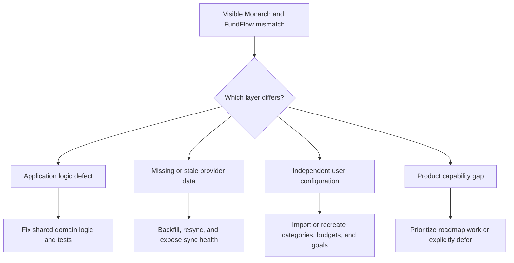

# Monarch and FundFlow Production Comparison

## Verdict

FundFlow is not yet aligned with Monarch for this real account.
Two discrepancies are confirmed application defects, several are missing or stale source data, and several are independent configuration differences that cannot be repaired by changing arithmetic.
The highest-priority code defects are recurring-expense classification and Dashboard next-due-date calculation.
The highest-priority operational defect is incomplete transaction and investment synchronization.

## Evidence boundary

- The comparison used the user's existing authenticated Chrome tabs for Monarch and FundFlow.
- The FundFlow target was `https://fund-flow-swart.vercel.app` on 2026-08-29 in America/Los_Angeles.
- Vercel reported the Production deployment ready, and GitHub showed PR #136 merged into `main` at `41feaba` with successful checks.
- The browser work was read-only.
- No transaction, category, budget, goal, recurring item, account, or setting was changed.
- This committed report omits email addresses, account masks, transaction identifiers, and screenshots.
- Detailed real-data screenshots remain under the gitignored `qa-shots/` directory.

## Root-cause summary

## Confirmed defects

### P1: Recurring purchases on credit cards are reported as credit-card bills

FundFlow assigns every outflow stream whose transaction account is a credit account to the `creditCards` total.
A subscription charged to a card is still an expense, while a credit-card statement bill is a separate liability payment concept.
This error moved ordinary recurring expenses out of the Expenses summary and produced a misleading credit-card total.
The incorrect branch is in `lib/recurring-page.ts::addPlannedTotals()` and is fed by `lib/recurring-data.ts` through `isCreditAccount`.
The existing unit test explicitly encoded the incorrect behavior.

Acceptance:

- An outflow recurring stream remains an expense regardless of its payment account type.
- The credit-card bill bucket is populated only from actual bill or liability data.
- Transfer and loan-payment categories remain excluded from cash-flow totals.

### P1: Dashboard ignores Plaid's predicted next recurring date

The Recurring page showed an expense due the next day, while the Dashboard said that nothing was due in the next seven days.
The Dashboard query did not select `predicted_next_date`.
It substituted the most recent matching transaction date or a fixed middle-of-month date, then filtered that stale date through the seven-day widget window.
The affected code is in `lib/dashboard.ts` and `components/dashboard/widgets/RecurringWidget.tsx`.

Acceptance:

- The Dashboard uses `predicted_next_date` when Plaid supplies it.
- A recurring item due tomorrow appears in the next-seven-days widget.
- The fallback remains deterministic when Plaid supplies no predicted date.

## Data completeness and freshness findings

### P1: FundFlow is missing transactions that exist in Monarch

Monarch reported 4,919 total transactions, while FundFlow reported 4,714.
The 205-row difference is not a presentation issue.
A current-month paycheck present in Monarch was absent from FundFlow search results even though the associated checking account exists in both products.
That missing row explains 7,000 of the current-month income difference.
The affected FundFlow checking account was also marked stale in the Accounts page.

Likely causes include incomplete initial history, an interrupted incremental cursor, provider-specific coverage, or a connection that requires repair.
The browser evidence cannot distinguish those causes because FundFlow does not expose per-item transaction coverage, cursor state, or the last successful historical backfill.

Acceptance:

- Every institution exposes the last successful transaction sync, newest imported transaction, oldest imported transaction, cursor health, and recoverable provider error.
- A repair action can request a safe bounded backfill without creating duplicates.
- The transaction count and current-month income reconcile after the source row is available.

### P1: Investment accounts are present but holdings and balances are stale

Both products show the same two retirement accounts.
Monarch has security names, quantities, prices, allocations, and newer account values.
FundFlow has only account-level balance fallbacks, reports the accounts as stale by roughly seven weeks, and has no synchronized holding rows.
The account-level portfolio total trails Monarch by about 895 for the captured snapshot.

FundFlow already contains Plaid Investments synchronization code, webhook handling, holdings tables, and an account-balance fallback.
The remaining issue is therefore operational product availability, stale item state, failed synchronization, or missing observability rather than a missing page implementation.

Acceptance:

- The app distinguishes `product_not_ready`, `no_investment_product`, rate limiting, stale data, and a successful empty portfolio.
- Users can see which institution needs repair.
- A successful holdings sync populates securities, quantities, prices, values, allocations, and snapshots.
- Account-balance fallback remains honest when the provider cannot supply holdings.

### P2: Net worth differs for understandable but undisclosed reasons

Monarch includes an additional cash account entry and newer retirement values.
FundFlow omits that additional cash balance and uses stale retirement balances.
The resulting net-worth gap is a source-coverage difference, not a repeat of the signed-liability bug fixed in PR #136.

FundFlow should show a reconciliation explanation rather than implying that all connected data is equally current and complete.

## Classification and configuration mismatches

### P1: The same purchase is spending in Monarch and a transfer in FundFlow

Monarch classifies one large jewelry purchase as Shopping.
FundFlow retains Plaid's `TRANSFER_OUT` classification and excludes it from cash flow through the canonical transfer rules.
That single category disagreement explains most of the current-month spending gap.
The remaining difference is spread across smaller category, pending, and posting-date differences.

FundFlow's transfer exclusion is correct for a real transfer.
The bug is the lack of an account-specific override or migration path that carries the user's Monarch classification into FundFlow.

Acceptance:

- A user can recategorize an individual transaction without weakening global transfer exclusion rules.
- Imported Monarch transaction categories survive import and can override Plaid for that transaction.
- The UI shows when a transaction is excluded from cash flow and why.
- Cash Flow, Reports, Dashboard, Budget actuals, and exports consume the same canonical override.

### P1: Budgets are not configured in FundFlow

Monarch has planned income and three expense groups with category budgets.
FundFlow shows zero planned values and offers `Create from history`.
This is not a calculation defect because FundFlow has no equivalent budget records for the account.

Acceptance:

- The first-run state explains that the actuals are present but the plan has not been migrated.
- A previewable Monarch budget import maps groups, categories, monthly amounts, and non-monthly treatment before any write.
- `Create from history` remains an alternative, not an automatic mutation.

### P1: Goals are independently configured

The products have an emergency-fund goal with different target amounts, funded amounts, target dates, and linked accounts.
FundFlow is internally consistent after PR #136, but it is not configured to match Monarch.

Acceptance:

- A goal migration flow can preview and import target amount, target date, linked account, and current allocation.
- Existing FundFlow goals are never silently overwritten.
- A merge or replace choice is explicit and audited.

### P2: Category granularity differs

Monarch uses user-facing categories such as Shopping, Child Care, Child Activities, and Uncategorized.
FundFlow exposes Plaid primary and detailed categories unless an override exists.
The totals can be financially correct while the category story remains visibly different.

Acceptance:

- Category overrides support one transaction, one merchant rule, or a source-category mapping.
- Imported Monarch categories retain their user-facing labels.
- Reports can group by the user's display category without changing the raw Plaid category.

## Missing or materially weaker capabilities

### Implementation update on PR #137

Phase 1 adds read-only per-institution transaction and investment health, bounded transaction coverage, recovery guidance, and snapshot-anchored account reconciliation.
Phase 2 adds authenticated, rate-limited repair with a bounded historical backfill, item-scoped cursor health, and settings repair controls that explain provider-conditional states.
Phase 3 adds transaction-level classification overrides (a provider TRANSFER_OUT can be deliberately corrected to spending across every canonical surface) and a Monarch import that previews Plaid-vs-Monarch classification conflicts, stages notes/tags, reuses source-account mappings, and never overwrites a newer edit without approval.
Phase 4 adds versioned budget and goal configuration import with previewable plans, merge/replace-month/skip and create/merge/skip/replace choices, and imported-identifier goal matching.
Phase 5 surfaces per-item investment sync status and syncs real credit-card bills from the approved Plaid Liabilities integration into the Recurring credit-card bucket.
Phase 6 adds a recurring calendar with a table twin, editable life-event forecasting through the existing projection engine, a Dashboard weekly-report entry point, and advice pin/reorder.
Production deployment claims and the authenticated read-only browser comparison remain pending verification.

## Implementation status on branch `codex/monarch-production-alignment`

Phases 0 through 6 are implemented with reachable migrations, data paths, UI flows, authorization boundaries, and acceptance tests.
The re-reviewed CI-equivalent suite passes 4,126 tests with 19 live-database suites skipped when no service credential is supplied, and coverage is 98.15% statements, 95.05% branches, 98.8% functions, and 99.13% lines.
Lint, typecheck, palette validation, focused signed-in life-event acceptance, linked migration-ledger inspection, and the three-migration dry run pass locally.
The fresh PR-head production build and remote analysis checks remain pending, and the new live credit-card payment-account ownership assertion requires the pending ownership migration before it can pass against the linked database.
The visual-baseline spec has pre-existing run-to-run variance (it fails identically at the PR base commit) and is unrelated to these changes.
Dependency major bumps (ESLint 10, Plaid 46, TypeScript 7) remain intentionally excluded per the dependency-freshness convention.
The exact Production deployment commit and the read-only authenticated browser comparison have not yet been performed.

### High value

- FundFlow now exposes a recurring calendar view with a table twin, real credit-card bill synchronization (statement balance and due date) via the approved Plaid Liabilities path, per-item investment sync status, Monarch configuration import for budgets and goals, and a weekly-recap Dashboard entry point.
- Synchronized security-level holdings for this Production account, the authenticated read-only browser comparison, and the Production deployment commit remain pending verification against the deployment system.

### Medium value

- Monarch has a weekly recap entry point on the Dashboard, while FundFlow's weekly report history lives under Notifications and is less discoverable.
- Monarch forecasting supports interactive life events such as buying a home, having a child, adding income or expenses, and changing retirement age.
- FundFlow forecasting supports numeric scenarios and milestones but lacks the same event timeline and drag-based exploration.
- Monarch lets users prioritize advice topics directly from the Advice surface.
- FundFlow has categorized educational checklists but a weaker prioritization workflow.
- Monarch has richer merchant and category drill-down destinations from transaction rows.

### Deliberately deferred or provider-dependent

- Monarch shows a credit-score widget.
- FundFlow should not imitate a credit score with invented data.
- This requires a real credit-data provider, explicit consent, security review, pricing review, and a product decision before implementation.
- Monarch has referral, billing, and commercial support surfaces that are not financial-planning parity requirements.

## FundFlow strengths that should be preserved

- FundFlow has Debt payoff, Year in Money, Review, receipt handling, explicit signed cash-flow semantics, and detailed forecasting tables.
- FundFlow discloses that forecasts are projections rather than guarantees.
- FundFlow provides account-level investment fallback instead of pretending missing holdings exist.
- FundFlow uses one canonical financial projection for Dashboard, Cash Flow, Reports, Budget actuals, and exports.
- FundFlow's current responsive shell did not show document-level horizontal overflow in the prior production audit.

## Dependency freshness note

`npx npm-check-updates` reported newer packages, including major updates for ESLint, Plaid, and TypeScript.
Dependency upgrades are intentionally excluded from this financial-correctness branch.
The Vercel CLI is also one patch behind and should be upgraded from 59.9.1 to the current release before deployment verification.
