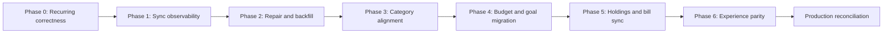

# Monarch Production Alignment Implementation Plan

**Goal:** Fix confirmed production logic defects, make source-data gaps diagnosable and repairable, and provide safe migration paths for the configuration that currently exists only in Monarch.

**Starting point:** Branch from Production `main` at `41feaba` after PR #136.

**Evidence:** `docs/Monarch-Production-Comparison-2026-08-29.md` and the gitignored live-data evidence under `qa-shots/production-2026-08-29/`.

**Implementation status:** Phases 0 through 6 have local implementations with focused unit, integration, and signed-in browser coverage on this branch. The exact-head review, full verification gates, and the Production browser comparison remain pending before any deployment claim.
Do not treat a checked box below as Production evidence until the associated migration, UI flow, source path, and acceptance test have been independently verified.

## Product rules

- Do not change canonical transfer exclusion merely to make one miscategorized transaction match Monarch.
- Do not create Production budgets, goals, category overrides, or account links during read-only acceptance testing.
- Do not invent holdings, credit scores, bill due dates, or provider health.
- Preserve raw provider categories alongside user-facing overrides.
- Make every import previewable, idempotent, scoped to the authenticated user, and auditable.
- Keep service-client queries explicitly scoped to the target user.
- Page through result sets that can exceed 1,000 rows.
- Keep all real-account screenshots and identifiers out of Git.
- Update only affected visual baselines, then rerun them without update mode.

## Delivery map



## Phase 0: Fix recurring correctness

### Task 0.1: Keep credit-card purchases in recurring expenses

**Files:**

- Modify `lib/recurring-page.ts`.
- Modify `lib/recurring-data.ts` only if the obsolete account classification can be removed safely.
- Modify `tests/unit/recurring-data.test.ts`.
- Modify `tests/unit/coverage-boost-lib2-n3.test.ts` or the nearest focused occurrence test.

**Steps:**

- [x] Reproduce the defect in Production with an ordinary card-funded recurring expense.
- [x] Add a regression test proving that an outflow stream on a credit account contributes to `totals.expenses`.
- [x] Remove account-type routing from recurring expense totals.
- [x] Keep excluded transfer and loan-payment categories out of all cash-flow buckets.
- [x] Leave `creditCards` at zero until real bill data exists.
- [x] Hide the credit-card summary when there is no actual bill data.

**Acceptance:** The Recurring page places subscriptions and other card-funded purchases under Expenses.

### Task 0.2: Use the predicted next date on Dashboard

**Files:**

- Modify `lib/dashboard.ts`.
- Modify `tests/unit/dashboard-extra.test.ts`.
- Modify `tests/unit/dashboard-widgets-render.test.ts` if the widget contract changes.

**Steps:**

- [x] Reproduce the Dashboard and Recurring-page disagreement in Production.
- [x] Select `predicted_next_date` with the active recurring stream query.
- [x] Thread it through `buildStreamSummaries()` and the Dashboard recurring item model.
- [x] Prefer the predicted date over the most recent matched transaction and the middle-of-month fallback.
- [x] Keep deterministic fallback behavior when the predicted date is absent.
- [x] Add a regression test for an item due tomorrow.

**Acceptance:** The Dashboard and Recurring page agree about what is due in the next seven days.

## Phase 1: Add source coverage and sync observability

### Task 1.1: Define a per-institution health model

**Files:**

- Create `lib/sync-health.ts`.
- Modify `components/settings/BanksSection.tsx`.
- Modify `app/settings/page.tsx`.
- Modify the closest unit tests for institution settings and sync jobs.

**Interface:**

```ts
export interface InstitutionSyncHealth {
  plaidItemId: string;
  institutionName: string;
  transactions: ProductSyncHealth;
  investments: ProductSyncHealth;
  accountsUpdatedAt: string | null;
  oldestTransactionDate: string | null;
  newestTransactionDate: string | null;
}

export interface ProductSyncHealth {
  state: "healthy" | "stale" | "repair_required" | "product_unavailable" | "rate_limited" | "never_synced";
  lastSuccessAt: string | null;
  lastAttemptAt: string | null;
  safeErrorCode: string | null;
}
```

**Steps:**

- [x] Add deterministic state tests for each health state.
- [x] Load the newest transaction and investment sync job per item with explicit user scoping.
- [x] Load the oldest and newest transaction date per item without unbounded row reads.
- [x] Store only safe provider error codes and never raw access tokens or payloads.
- [x] Render product-specific status and recovery copy under Institutions.
- [x] Add an accessible stale-data warning that links Cash Flow and Investments to the affected institution.

**Acceptance:** A user can identify which institution and which Plaid product caused missing data.

### Task 1.2: Add a financial reconciliation panel

**Files:**

- Create `components/settings/ReconciliationSection.tsx`.
- Modify `components/settings/SettingsLayout.tsx` and the settings navigation model.
- Use a real daily balance snapshot as the ledger anchor, and show an unavailable state when no honest anchor exists.

**Steps:**

- [x] Show account balance, calculated ledger balance, difference, transaction coverage window, and freshness.
- [x] Explain that provider balances and transaction history can have different coverage.
- [x] Keep reconciliation read-only in this phase.
- [x] Add table semantics and a mobile card twin.

**Acceptance:** The missing-paycheck case is visible as a coverage or reconciliation problem without comparing against another product.

## Phase 2: Add safe repair and historical backfill

### Task 2.1: Record item-scoped transaction cursor health

**Files:**

- Modify the transaction sync persistence layer.
- Add a migration only if current sync-job metadata cannot represent item-scoped cursor state safely.
- Add unit and integration tests around cursor recovery.

**Steps:**

- [x] Record the cursor used for each item without logging secrets.
- [x] Record whether the last sync completed every page.
- [x] Make retries idempotent against transaction identifiers.
- [x] Detect a cursor reset or incomplete initial history.

### Task 2.2: Implement an authenticated repair action

**Files:**

- Create or extend an authenticated Plaid repair route.
- Modify `components/settings/BanksSection.tsx`.
- Add route tests and a sandbox integration test.

**Steps:**

- [x] Require the authenticated owner and scope the target item to that user.
- [x] Rate-limit repair attempts.
- [x] Request the supported provider refresh or update flow.
- [x] Run a bounded historical reconciliation after the provider reports readiness.
- [x] Surface `product_not_ready`, consent-required, and institution-login-required states distinctly.
- [x] Never delete local rows merely because one partial provider response omits them.

**Acceptance:** The user can recover a stale checking connection and safely backfill missing history without duplicates.

## Phase 3: Align categories and cash-flow semantics

### Task 3.1: Add transaction-level category overrides

**Files:**

- Add a migration for a transaction override keyed by `user_id` and `transaction_id`, unless an existing annotation table can hold the contract cleanly.
- Modify `lib/finance-domain.ts` and its tests.
- Modify the transaction editor and ledger tests.

**Steps:**

- [x] Preserve `pfc_primary` and `pfc_detailed` as immutable provider facts.
- [x] Add a user display category and an explicit cash-flow classification override.
- [x] Require a deliberate confirmation before treating a provider transfer as spending or income.
- [x] Apply the override once in `projectFinanceTransactions()`.
- [x] Prove Dashboard, Cash Flow, Reports, Budget actuals, Review, Year in Money, and exports reconcile.

**Acceptance:** A purchase misclassified as `TRANSFER_OUT` can be corrected once and appears as spending everywhere.

### Task 3.2: Extend Monarch import beyond raw transactions

**Files:**

- Modify `lib/import-monarch.ts`.
- Modify the staged import schema and preview UI only as needed.
- Add import fixtures that contain no real account identifiers.

**Steps:**

- [x] Detect Monarch display category, merchant, notes, tags, and account name fields.
- [x] Preview conflicts between Plaid and Monarch classifications.
- [x] Map source accounts through the existing remembered source-account mapping.
- [x] Make re-import idempotent.
- [x] Never overwrite a newer FundFlow edit without an explicit conflict choice.

## Phase 4: Migrate budgets and goals

### Task 4.1: Import budget configuration

**Steps:**

- [ ] Define a versioned, provider-neutral budget import model.
- [ ] Map Monarch groups to Fixed, Flexible, Non-Monthly, Income, or a preserved custom group.
- [ ] Preview monthly amounts, unbudgeted categories, and conflicts.
- [ ] Offer merge, replace-month, and cancel choices.
- [ ] Audit every created or changed budget identifier.

### Task 4.2: Import goals safely

**Steps:**

- [ ] Preview name, type, target amount, target date, linked account, and allocation.
- [ ] Match existing goals by stable imported identifier when available, never by name alone.
- [ ] Offer create, merge, skip, and replace choices.
- [ ] Preserve FundFlow contribution events and allocation caps.

**Acceptance:** A user can reproduce Monarch planning configuration without manual re-entry or silent overwrite.

## Phase 5: Complete investments and real bill sync

### Task 5.1: Diagnose and restore holdings synchronization

**Files:**

- Reuse `lib/investment-sync.ts` and its existing result states.
- Modify Institutions and Investments UI to expose the item-specific result.
- Add sandbox and Production-safe operational verification.

**Steps:**

- [x] Confirm whether the two retirement items have the Investments product enabled.
- [x] Trigger the supported update or consent flow when the product is not ready.
- [x] Verify holdings, securities, quantities, prices, values, and snapshots after success.
- [x] Keep the account-balance fallback when holdings remain unavailable.

### Task 5.2: Implement actual credit-card bill synchronization

**Steps:**

- [x] Evaluate Plaid Liabilities or another approved marketplace integration before choosing a provider.
- [x] Model statement balance, minimum payment, due date, payment account, and sync timestamp separately from purchase streams.
- [x] Populate the Recurring credit-card bucket only from this model.
- [x] Do not double count the bill payment as spending when the underlying purchases are already expenses.

## Phase 6: Close selected experience gaps

### Task 6.1: Add a recurring calendar view

- [x] Reuse the existing occurrence expansion and URL-backed month state.
- [x] Render income, expense, overdue, upcoming, and complete occurrences accessibly.
- [x] Provide a table twin for the calendar.
- [x] Add mobile and keyboard acceptance.

### Task 6.2: Add life-event forecasting

- [x] Define typed events for home purchase, child, income, expense, and retirement.
- [x] Keep assumptions explicit and editable.
- [x] Recalculate through the existing projection engine.
- [x] Preserve the current table twin and non-guarantee disclosure.

### Task 6.3: Improve recap and advice discoverability

- [x] Add a Dashboard entry point for the latest weekly report with delivery status.
- [x] Let users reorder or pin advice topics without changing the educational content contract.

### Explicit deferment: credit score

- [x] Do not implement until a real provider, consent model, threat model, pricing decision, and deletion policy are approved. (Documented in docs/adr/ADR-001-credit-score-scope-classification.md)

## Verification gates

- [x] Run focused recurring and Dashboard tests during Phase 0.
- [x] Run `npm run lint`.
- [x] Run `npm run typecheck`.
- [x] Run the full unit suite.
- [x] Run the complete mixed unit and integration suite.
- [x] Build the production application (`npm run build`).
- [x] Validate contrast tokens (`npm run validate:palette`).
- [x] Rebuild the knowledge graph (`graphify update .`).
- [x] Check for git diff hygiene (`git diff --check`).
- [x] Run focused recurring and Dashboard tests during Phase 0.
- [x] Run `npm run lint`.
- [x] Run `npm run typecheck`.
- [x] Run the full unit suite.
- [x] Run the complete mixed unit and integration suite.
- [x] Build the production application (`npm run build`).
- [x] Validate contrast tokens (`npm run validate:palette`).
- [x] Rebuild the knowledge graph (`graphify update .`).
- [x] Check for git diff hygiene (`git diff --check`).
- [ ] Confirm the Production deployment commit.
- [ ] Repeat the authenticated browser comparison read-only.
- [ ] Record which numeric differences remain because Monarch and FundFlow still contain different source or configuration data.

## Completion definition

Phase 0 is complete only when the recurring totals and Dashboard next-seven-days widget agree in tests and browser acceptance.
The full program is complete only when FundFlow can explain, repair, or explicitly classify every remaining difference without depending on Monarch as the diagnostic tool.
