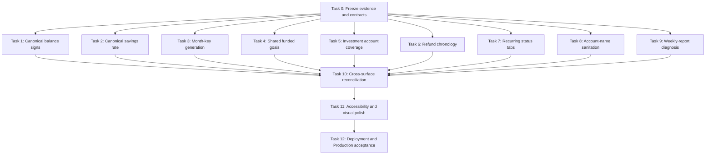

# Production Live-Data Remediation Implementation Plan

> **For implementers:** Execute this plan task by task with tests written before each production-code change.
> Keep the checklist current as work is completed.

**Goal:** Remove the eight user-visible inconsistencies confirmed in Production with `navaneethbv@gmail.com`, diagnose and close the weekly-report history gap, and prove that every affected surface agrees on the same financial facts.

**Architecture:** Fix each inconsistency at its shared domain boundary, then make the affected pages consume that canonical result.
Balance signs, savings rates, goal funding, investment coverage, date windows, and refund chronology must each have one explicit contract.
UI components may format or label those results, but they must not reimplement the financial calculation.

**Tech stack:** Next.js 16 App Router, React 19, TypeScript, Supabase Postgres, Plaid, Vitest, Playwright, GitHub Actions, and Vercel.

**Production evidence:** `qa-shots/production-2026-08-29/PRODUCTION-LIVE-DATA-QA.md` and its gitignored screenshots.

**Current baseline:** Production was reviewed on 2026-08-29 at `https://fund-flow-swart.vercel.app` using existing data for `navaneethbv@gmail.com` without mutating financial records.

## Success criteria

- [ ] Accounts, Dashboard Monitor, Dashboard Wealth, Debt payoff, and Forecasting use the same signed balance semantics and reconcile to a net worth of `$55,969.41` for the captured Production snapshot.
- [ ] Investments recognizes the two connected retirement accounts and reconciles their displayed total to `$44,423.04` even when security-level holdings have not been populated.
- [ ] Dashboard Overview, Dashboard Plan, and Goals all show the Emergency fund as `$4,000.00 / $20,000.00`, with `$16,000.00` remaining.
- [ ] Dashboard Monitor shows the signed August savings rate, Cash Flow retains its signed rate, and Year in Money reports approximately `-39.78%` instead of `0%` for the captured annual totals.
- [ ] An August dashboard view contains March through August in its six-month series, never September, and never compares August against itself.
- [ ] Refund suggestions never pair a refund dated before its charge.
- [ ] Overdue recurring items have a distinct label, count, list, and total from upcoming items.
- [ ] No rendered account label contains Unicode replacement characters.
- [ ] The missing weekly-report periods are classified from delivery rows and scheduler evidence, the proven cause is repaired, and the UI exposes recorded failure or skip reasons.
- [ ] Budget, Goals, Investments, and Year in Money have a valid heading hierarchy without visual regressions.
- [ ] Focused unit tests, the full unit suite, lint, typecheck, build, targeted Playwright coverage, and post-deployment read-only Production verification all pass.

## Scope and safety constraints

- Use real Production data only for read-only acceptance verification.
- Use deterministic, anonymized fixtures in committed tests.
- Do not copy the email address, account masks, institution identifiers, transaction identifiers, or screenshots into committed fixtures.
- Keep `qa-shots/` gitignored because it contains real financial information.
- Do not create, edit, delete, confirm, dismiss, allocate, import, or export financial records during acceptance testing.
- A Production account-name refresh is allowed only as a separately approved metadata repair after the code fix is deployed.
- Do not guess the missing symbol in the corrupted Wells Fargo name.
- Do not send historical weekly-report emails automatically.
- Do not change unrelated dependencies as part of this remediation.
- The dependency check found safe patch or minor updates and several major updates, but they are intentionally out of scope so financial fixes are not mixed with toolchain changes.
- Before deployment work, upgrade the local Vercel CLI from `59.9.1` to the current version with `npm i -g vercel@latest` or `pnpm add -g vercel@latest`.
- Before changing Next.js code, read the relevant installed guidance under `node_modules/next/dist/docs/` for App Router server components, route handlers, and data fetching.

## Fixed product decisions

### Balance semantics

- An asset account contributes its stored balance directly to net worth.
- A liability account contributes the negative of its stored balance to net worth.
- A positive credit or loan balance is money owed and belongs in liabilities.
- A negative credit or loan balance is a credit in the user's favor and belongs in assets.
- Asset and liability summary totals remain non-negative magnitudes.
- A row may display a signed liability balance so an overpaid card is visibly a credit rather than positive debt.

### Savings-rate semantics

- Savings rate is `(income - spending) / income * 100` when income is greater than zero.
- Negative rates are valid and must not be clamped.
- A period with zero or negative income returns `null` and renders as `N/A`, because a percentage has no meaningful denominator.
- Progress visuals may clamp their fill to the supported visual range, but the visible text and accessible label must preserve the signed value.

### Goal-funding semantics

- `FundedGoal` from `lib/goals-v2.ts` is the canonical model when `goalsV2` is enabled.
- Dashboard views must not compute progress from `Goal.saved_amount` alone when linked allocation or progress events exist.
- Save-up funding remains manual progress plus capped account allocations plus signed progress events.
- Pay-down funding remains the linked-liability balance delta and must not double-count progress events.

### Investment semantics

- The existence of eligible investment accounts and the existence of holding rows are separate facts.
- A connected investment account without holdings is not an empty portfolio.
- For each eligible account, use active holding value when holdings are available for that account; otherwise use the account balance.
- Never add both the holding total and the account balance for the same account.
- The UI must disclose when it is showing an account-balance fallback because holdings are unavailable.

### Refund semantics

- A refund candidate must be on or after its charge date and within the configured window.
- Matching remains same normalized merchant and same rounded absolute amount.
- When several refunds qualify, choose the closest non-negative date difference, then date, then stable identifier.
- Each refund may be used once.

### Recurring semantics

- `overdue`, `upcoming`, and `complete` are distinct user-facing states.
- The Upcoming count and total contain only `status === "upcoming"`.
- The Overdue count and total contain only `status === "overdue"`.
- Existing `?tab=upcoming`, `?tab=complete`, and `?tab=manage` links remain valid.

## Dependency map



## Task 0: Establish the implementation baseline

**Files:**

- Read: `qa-shots/production-2026-08-29/PRODUCTION-LIVE-DATA-QA.md`
- Read: `docs/HANDOFF.md`
- Read: `node_modules/next/dist/docs/`
- No code changes.

**Steps:**

- [ ] Create a `codex/production-live-data-remediation` branch from the exact deployed `main` commit.
- [ ] Record the starting commit SHA and verify that it matches the Vercel Production deployment.
- [ ] Confirm the worktree contains no unrelated changes before implementation.
- [ ] Upgrade the local Vercel CLI and record `vercel --version` in the implementation notes.
- [ ] Run the existing focused tests before changing code so pre-existing failures are not attributed to this work.
- [ ] Run the current Playwright flows for Accounts, Dashboard, Goals, Investments, Recurring, Cash Flow, and Transactions.
- [ ] Reproduce each confirmed bug locally with anonymized fixtures that preserve the Production signs and relationships.
- [ ] Preserve the Production screenshot filenames as traceability references, but never commit the images.

**Baseline command set:**

```bash
npx vitest run \
  tests/unit/accounts-page.test.ts \
  tests/unit/dashboard-ui.test.ts \
  tests/unit/dashboard-finance-parity.test.ts \
  tests/unit/annual.test.ts \
  tests/unit/cash-flow.test.ts \
  tests/unit/goals-v2.test.ts \
  tests/unit/investments-data.test.ts \
  tests/unit/investments-render.test.ts \
  tests/unit/recurring-list.test.ts \
  tests/unit/refund-netting.test.ts \
  tests/unit/cron-weekly-report-route.test.ts \
  tests/unit/weekly-scheduler.test.ts
```

**Exit gate:** Every work item has a failing test or a documented operational query that reproduces the exact defect before its fix begins.

## Task 1: Create one canonical signed-balance contract

**Files:**

- Create: `lib/account-balance.ts`
- Modify: `lib/accounts-page.ts`
- Modify: `components/dashboard/metrics.ts`
- Modify if required by reconciliation: `lib/net-worth.ts`
- Modify if required by reconciliation: `lib/forecasting.ts`
- Modify if required by reconciliation: `lib/planning.ts`
- Test: `tests/unit/accounts-page.test.ts`
- Test: `tests/unit/dashboard-ui.test.ts`
- Test: `tests/unit/dashboard-reconciliation.test.ts`
- Test: `tests/unit/net-worth-lib.test.ts`
- Test: `tests/unit/forecasting.test.ts`

**Interfaces:**

```ts
export type BalanceKind = "asset" | "liability";

export function isLiabilityAccount(
  type: string | null,
  subtype?: string | null,
): boolean;

export function netWorthContribution(
  balance: number | null,
  type: string | null,
  subtype?: string | null,
): number;

export function classifyBalanceSheetAmount(
  balance: number | null,
  type: string | null,
  subtype?: string | null,
): { kind: BalanceKind; amount: number };
```

**Steps:**

- [ ] Add failing pure tests for a `$100` cash asset, a `$100` credit balance, a `-$2.11` credit balance, a `$100` loan, null balances, and manual `liability` or `debt` types.
- [ ] Assert that a positive `$100` credit balance contributes `-$100` to net worth and is classified as a `$100` liability.
- [ ] Assert that a `-$2.11` credit balance contributes `+$2.11` to net worth and is classified as a `$2.11` asset.
- [ ] Implement the three helpers without `Math.abs()` in the net-worth contribution path.
- [ ] Replace `lib/accounts-page.ts::displayBalance()` usage in balance-sheet totals with the shared classification result.
- [ ] Change the account row representation so a negative credit balance is not rendered as positive debt.
- [ ] Change group totals to preserve the signed net position of rows in that group.
- [ ] Change `buildNetWorthSeries()` to use `netWorthContribution()` for every snapshot instead of `-Math.abs(snapshot.currentBalance)`.
- [ ] Keep `summary.assets`, `summary.liabilities`, `assetsByGroup`, and `liabilitiesByGroup` as non-negative magnitudes.
- [ ] Move `computeNetWorth()` in `components/dashboard/metrics.ts` onto the same helper so Dashboard cannot drift from Accounts.
- [ ] Audit `lib/net-worth.ts`, `lib/forecasting.ts`, and `lib/planning.ts` for independent liability-sign conversions.
- [ ] Replace only calculations that represent current net worth or a balance-sheet snapshot.
- [ ] Preserve debt-planner behavior that intentionally excludes a negative card balance from amount owed.
- [ ] Add a reconciliation fixture with assets of `$58,094.71`, liabilities of `$2,125.30`, and net worth of `$55,969.41`.
- [ ] Add historical snapshot tests proving an overpaid card raises historical net worth and does not appear as positive historical debt.
- [ ] Add rendering assertions for explicit credit copy, such as `$2.11 credit`, if that is the final row presentation.

**Acceptance:** Accounts and Dashboard display the same `$55,969.41` net worth, Accounts reports `$2,125.30` of liabilities, and the overpaid Freedom card is not presented as money owed.

**No migration:** This task changes interpretation and presentation only.

## Task 2: Centralize signed savings-rate calculation

**Files:**

- Create: `lib/finance-metrics.ts`
- Modify: `components/dashboard/metrics.ts`
- Modify: `lib/cash-flow.ts`
- Modify: `lib/annual.ts`
- Modify: `components/dashboard/MonitorView.tsx`
- Modify: `components/charts/RadialGauge.tsx` only if its accessible output currently hides the signed value.
- Modify: `app/wrapped/page.tsx`
- Test: `tests/unit/dashboard-ui.test.ts`
- Test: `tests/unit/cash-flow.test.ts`
- Test: `tests/unit/cash-flow-render.test.ts`
- Test: `tests/unit/annual.test.ts`

**Interface:**

```ts
export function computeSavingsRate(
  income: number,
  spending: number,
): number | null;
```

**Steps:**

- [ ] Add failing table-driven tests for positive savings, break-even, overspending, zero income with spending, zero income without spending, and decimal rounding.
- [ ] Make the helper return a signed percentage when `income > 0` and `null` otherwise.
- [ ] Choose one rounding rule and use it everywhere.
- [ ] Prefer two-decimal domain precision, then let each surface format its desired display precision.
- [ ] Remove the non-positive savings clamp from `components/dashboard/metrics.ts`.
- [ ] Remove `Math.max(0, ...)` from `lib/annual.ts`.
- [ ] Replace the private calculation in `lib/cash-flow.ts` with the shared helper.
- [ ] Update Monitor props from `number` to `number | null`.
- [ ] Render `N/A` for a null rate and a signed number for a negative rate.
- [ ] Keep a zero-filled radial gauge for negative values if the gauge cannot represent a negative arc, but make the adjacent text and accessible label report the real signed percentage.
- [ ] Verify that Cash Flow keeps its existing negative-rate color treatment.
- [ ] Update Year in Money tests so `$71,866.97` income and `$100,456.92` spending produce approximately `-39.78%`.

**Acceptance:** Monitor no longer shows `0%` beside negative cash flow, Cash Flow remains correct, and Year in Money reports the signed annual result.

**No migration:** This task is pure calculation and rendering.

## Task 3: Fix the six-month dashboard window

**Files:**

- Modify: `lib/dashboard.ts`
- Test: `tests/unit/dashboard-finance-parity.test.ts`
- Test: `tests/unit/dashboard-extra.test.ts`
- Test: `tests/unit/dashboard-reconciliation.test.ts`
- Test: `tests/e2e/dashboard.spec.ts`

**Interface:** Reuse the existing month-key shifting helper instead of constructing local-time `Date` values from one-based month numbers.

**Steps:**

- [ ] Add a failing unit test asserting that active month `2026-08` produces exactly `2026-03` through `2026-08`.
- [ ] Add a year-boundary test asserting that active month `2026-02` produces `2025-09` through `2026-02`.
- [ ] Add a timezone-stability test that produces the same keys regardless of the process timezone.
- [ ] Replace `new Date(activeYear, activeMonthIndex - index, 15)` with string-based month-key arithmetic.
- [ ] Keep the array in oldest-to-newest order.
- [ ] Assert that the newest point equals `activeMonth` and that no future point is present.
- [ ] Assert that comparison copy never uses the active month as its own previous period.
- [ ] Add a Playwright check that the August chart ends at August and does not display September.

**Acceptance:** August compares to the intended prior period and every six-month series ends on August.

**No migration:** This task is pure date-window generation.

## Task 4: Make funded goals the dashboard source of truth

**Files:**

- Create: `lib/goal-summary.ts`
- Modify: `app/dashboard/page.tsx`
- Modify: `components/dashboard/GoalsSummary.tsx`
- Modify: `components/dashboard/widgets/GoalsWidget.tsx`
- Modify: `components/dashboard/OverviewView.tsx`
- Modify: `components/dashboard/PlanView.tsx`
- Reuse: `lib/goals-data.ts`
- Reuse: `lib/goals-v2.ts`
- Test: `tests/unit/goals-v2.test.ts`
- Test: `tests/unit/goals-data.test.ts`
- Test: `tests/unit/dashboard-widgets-render.test.ts`
- Test: `tests/unit/dashboard-widgets-data.test.ts`
- Test: `tests/e2e/dashboard.spec.ts`
- Test: `tests/e2e/goals.spec.ts`

**Interface:**

```ts
export interface GoalSummaryItem {
  id: string;
  name: string;
  targetAmount: number;
  fundedAmount: number;
  remainingAmount: number;
  progressPct: number;
  monthlyPace: number | null;
  complete: boolean;
}

export function toGoalSummaryItem(goal: FundedGoal): GoalSummaryItem;
export function toLegacyGoalSummaryItem(goal: Goal): GoalSummaryItem;
```

**Steps:**

- [ ] Add a failing test for a goal with `saved_amount = 0`, `$4,000` of valid linked allocation, a `$20,000` target, and no progress event.
- [ ] Assert the summary item reports `$4,000` funded, `$16,000` remaining, and `20%` progress.
- [ ] Add a test proving a funded goal with both allocation and events uses the existing `computeFundedGoals()` result without recomputing either source in the presentation mapper.
- [ ] Make `GoalSummaryItem` the only type accepted by `GoalsSummary`.
- [ ] Remove direct `Goal.saved_amount` reads from `GoalsSummary`.
- [ ] Update `GoalsWidget`, `OverviewView`, and `PlanView` prop types to consume summary items.
- [ ] In `app/dashboard/page.tsx`, evaluate `goalsV2` once.
- [ ] When enabled and a user exists, call `loadGoalsPageData(supabase, user.id)` and map its funded goals to summary items.
- [ ] When disabled, preserve the legacy behavior by loading `getGoals()` and mapping plain goals through `toLegacyGoalSummaryItem()`.
- [ ] Avoid issuing both the legacy goal query and the funded-goal query in the enabled path.
- [ ] Keep `getPlanSetupItems()` based on the mapped list length so empty-state logic remains stable.
- [ ] Keep all owner scoping in `loadGoalsPageData()` and do not add an unscoped service-client query.
- [ ] Add render tests for Overview and Plan values, progress bar labels, remaining amount, and monthly pace.
- [ ] Add an E2E assertion that Dashboard and Goals render the same funded amount for the same named goal.

**Acceptance:** Emergency fund renders as `$4,000.00 / $20,000.00` and `$16,000.00 remaining` on Dashboard Overview, Dashboard Plan, and Goals.

**No migration:** The required goal-account and progress-event tables already exist.

## Task 5: Represent connected investment accounts without holdings

**Files:**

- Modify: `lib/investments-data.ts`
- Modify: `lib/investments.ts`
- Modify: `app/investments/page.tsx`
- Create: `components/investments/ConnectedAccounts.tsx`
- Modify: `components/investments/AddManualHoldingForm.tsx` only if the account option shape changes.
- Test: `tests/unit/investments-data.test.ts`
- Test: `tests/unit/investments.test.ts`
- Test: `tests/unit/investments-render.test.ts`
- Test: `tests/e2e/investments.spec.ts`

**Interfaces:**

```ts
export interface InvestmentAccountSummary {
  id: string;
  name: string;
  source: "plaid" | "manual";
  type: string | null;
  subtype: string | null;
  balance: number | null;
  currency: string;
}

export interface InvestmentAccountCoverage {
  accounts: Array<InvestmentAccountSummary & {
    holdingValue: number | null;
    displayValue: number;
    valueSource: "holdings" | "account-balance";
  }>;
  total: number;
  accountsWithoutHoldings: number;
}

export async function loadInvestmentAccounts(
  supabase: SupabaseClient,
  userId: string,
): Promise<InvestmentAccountSummary[]>;

export function buildInvestmentAccountCoverage(
  accounts: InvestmentAccountSummary[],
  holdings: HoldingJoinRow[],
): InvestmentAccountCoverage;
```

**Steps:**

- [ ] Add failing loader tests for Plaid `investment` accounts, brokerage subtypes, manual investment accounts, non-investment exclusions, numeric strings from PostgREST, null balances, and owner scoping.
- [ ] Replace the all-account existence check with `loadInvestmentAccounts()`.
- [ ] Keep `loadHoldingAccountOptions()` only for the manual-holding form if non-investment attachment remains a supported product decision.
- [ ] If manual holdings should attach only to investment accounts, use the same filtered account list for the form and update tests accordingly.
- [ ] Add pure coverage tests for no accounts, accounts without holdings, all accounts with holdings, and mixed coverage.
- [ ] For mixed coverage, sum holdings for covered accounts and account balances for uncovered accounts.
- [ ] Ensure one account is never counted from both sources.
- [ ] Use `coverage.total` in the page header instead of `buildInvestmentsPage(holdings).total` alone.
- [ ] Render the true no-account empty state only when `coverage.accounts.length === 0`.
- [ ] When accounts exist but holdings are absent, render a Connected accounts panel with account names, balances, and a clear `Holdings not available yet` explanation.
- [ ] Keep the Add manual holding action available when a valid attachment account exists.
- [ ] When some holdings exist, render the holdings, allocation, performance, and movers panels plus an account-balance fallback disclosure for uncovered accounts.
- [ ] Do not fabricate securities, quantities, cost basis, allocation percentages, performance, or movers from an account balance.
- [ ] Keep performance `null` unless snapshot data is sufficient under the existing contract.
- [ ] Add E2E coverage for all three states: no eligible accounts, eligible accounts without holdings, and complete holdings.

**Acceptance:** The two retirement accounts are visible, the page total reconciles to `$44,423.04`, and the UI honestly states that security-level holdings are unavailable.

**No migration:** Existing account, holding, and snapshot tables contain the required data.

## Task 6: Enforce chronological refund matching

**Files:**

- Modify: `lib/transaction-quality.ts`
- Test: `tests/unit/roadmap-completion.test.ts`
- Test: `tests/unit/coverage-boost-lib2-n2.test.ts`
- Test: `tests/unit/refund-netting.test.ts`
- Test: `tests/unit/transactions-refunds-route.test.ts`
- Add or modify the nearest Transactions Playwright test.

**Steps:**

- [ ] Add a failing pure test with a charge on `2026-08-19` and an equal negative transaction on `2026-08-18`.
- [ ] Assert that this pair is rejected.
- [ ] Add boundary tests for same-day refund, refund exactly at `windowDays`, and refund one day beyond the window.
- [ ] Add a deterministic-choice test with several equal candidate refunds after the same charge.
- [ ] Sort charge processing by date and stable identifier so input query order cannot change the output.
- [ ] Calculate `candidateDate - chargeDate` without `Math.abs()`.
- [ ] Reject negative differences and differences greater than `windowDays`.
- [ ] Rank eligible candidates by non-negative difference, candidate date, then identifier.
- [ ] Preserve the one-refund-per-pair guard.
- [ ] Verify existing confirmed links and refund netting are unchanged.
- [ ] Add an E2E assertion that the refund-review UI never offers a date-inverted pair.

**Acceptance:** The captured August 18 refund is never suggested for the August 19 charge.

**No migration:** Existing confirmed refund links remain valid and untouched.

## Task 7: Split overdue recurring occurrences from upcoming occurrences

**Files:**

- Modify: `components/recurring/RecurringList.tsx`
- Modify: `app/recurring/page.tsx`
- Modify if copy needs a reusable badge: `components/ui/Badge.tsx`
- Test: `tests/unit/recurring-list.test.ts`
- Test: `tests/unit/recurring-list-render.test.ts`
- Test: `tests/unit/recurring-page.test.ts`
- Test: `tests/e2e/recurring.spec.ts`

**Interface:**

```ts
export type RecurringTab = "overdue" | "upcoming" | "complete" | "manage";
```

**Steps:**

- [ ] Add failing tests proving overdue occurrences are excluded from the Upcoming collection and total.
- [ ] Add the `overdue` tab to `RecurringTab`, `RECURRING_TABS`, link construction, link records, and parsing.
- [ ] Keep `upcoming` as the default tab to preserve existing bookmarks and expected landing behavior.
- [ ] Derive three exact arrays from occurrence status instead of treating every non-complete row as upcoming.
- [ ] Add an Overdue tab with its own count and total.
- [ ] Add explicit `Overdue` text in overdue rows in addition to the relative date annotation.
- [ ] Preserve the existing row actions for overdue occurrences.
- [ ] Preserve `month` and `scope` parameters when changing tabs or months.
- [ ] Add empty copy specific to each state.
- [ ] Add tests for unknown tabs falling back to Upcoming and for old URLs remaining valid.
- [ ] Add responsive E2E checks for the four-tab layout at 390 px and 768 px.

**Acceptance:** Apple Card appears only under Overdue with a `$19.98` overdue total, while Upcoming totals `$110.45` for the captured Production snapshot.

**No migration:** `RecurringOccurrence.status` already distinguishes overdue records.

## Task 8: Sanitize external account display names and repair existing metadata

**Files:**

- Create: `lib/external-display-text.ts`
- Modify: `lib/plaid-service.ts`
- Modify if account refresh bypasses `upsertAccounts()`: the relevant sync path under `app/api/plaid/`
- Test: `tests/unit/plaid-service-lib.test.ts`
- Test: `tests/unit/sync-lib.test.ts`
- Test: `tests/unit/dashboard-extended.test.ts`
- Test: `tests/unit/accounts-page-render.test.ts`
- Operational verification only: Production Plaid refresh for the affected item.

**Interface:**

```ts
export function normalizeExternalDisplayText(
  value: string | null | undefined,
): string | null;
```

**Normalization contract:**

- Normalize to Unicode NFC.
- Remove one or more Unicode replacement characters.
- Collapse whitespace created by removal.
- Trim leading and trailing whitespace.
- Return `null` when no visible text remains.
- Preserve valid Unicode symbols, accents, apostrophes, hyphens, and non-Latin scripts.
- Never infer whether the lost character was a registered-mark symbol, trademark symbol, punctuation, or another glyph.

**Steps:**

- [ ] Before coding, inspect the stored `name` and `official_name` and compare them with the current Plaid `/accounts/get` response for the affected account without logging access tokens or full account identifiers.
- [ ] Record whether corruption originates upstream, in transport, or in the stored row.
- [ ] Add failing tests for `VISA�� CARD`, valid `VISA® CARD`, accented names, repeated whitespace, only replacement characters, and null input.
- [ ] Apply normalization to Plaid account `name` and `official_name` inside `upsertAccounts()` so exchange, reconnect, and refresh paths share it.
- [ ] Confirm every account-refresh path reaches `upsertAccounts()`.
- [ ] Add a render-level defense only if another trusted source can bypass the normalized ingestion path.
- [ ] Do not scatter `.replace()` calls across Dashboard and Accounts components.
- [ ] Deploy the normalization code before repairing the existing row.
- [ ] With explicit approval, run the ordinary authenticated bank refresh for the affected Wells Fargo item so Plaid metadata is re-upserted through the normalized path.
- [ ] If Plaid itself still returns replacement characters, verify the normalized stored label becomes `WELLS FARGO AUTOGRAPH VISA CARD` or the valid upstream equivalent.
- [ ] If Plaid returns a clean label but the refresh does not update the row, repair the specific row through a reviewed, id-scoped operator command that copies the upstream value.
- [ ] Never create a broad SQL replacement across every account name.

**Acceptance:** Dashboard and Accounts render the same clean Wells Fargo label and no visible account name contains `U+FFFD`.

**Migration decision:** No schema migration is expected.
A narrowly scoped data repair may be executed operationally after the source is verified.

## Task 9: Diagnose and close the weekly-report history gap

**Files:**

- Inspect: `.github/workflows/weekly-report.yml`
- Inspect: `app/api/cron/weekly-report/route.ts`
- Inspect: `lib/report-delivery.ts`
- Inspect: `app/notifications/page.tsx`
- Inspect: `vercel.json`
- Modify conditionally: `.github/workflows/weekly-report.yml`
- Modify conditionally: `app/notifications/page.tsx`
- Create conditionally: `lib/weekly-delivery-history.ts`
- Test: `tests/unit/cron-weekly-report-route.test.ts`
- Test: `tests/unit/weekly-scheduler.test.ts`
- Test: `tests/unit/weekly-report-schema.test.ts`
- Create or extend a delivery-history render test.

**Known architecture:** Vercel schedules only `/api/cron/sync` daily.
The weekly report is invoked hourly by `.github/workflows/weekly-report.yml` so delivery can honor each user's Monday morning timezone.

### Task 9A: Collect evidence before selecting a fix

- [ ] Query `weekly_report_deliveries` for the affected user and periods `2026-08-03` through `2026-08-16` using an owner-scoped or reviewed admin query.
- [ ] Retrieve `period_start`, `period_end`, `status`, `error_code`, `attempted_at`, and `sent_at`.
- [ ] Confirm whether the two periods have no rows or have rows omitted by the current six-entry display.
- [ ] Inspect GitHub Actions runs from August 3 through August 18 for scheduled-run execution, cancellation, disabled workflow state, secret failures, HTTP status, and response body.
- [ ] Confirm `FUNDFLOW_APP_URL` targeted the Production deployment at that time.
- [ ] Confirm `CRON_SECRET` was available to the workflow without revealing its value.
- [ ] Inspect Vercel function logs for `/api/cron/weekly-report` calls during the same window.
- [ ] Correlate route response counts with delivery rows.
- [ ] Confirm whether the profile had `weekly_report_enabled = true` and a valid timezone for both periods.
- [ ] Write a short incident note classifying each missing period as scheduler not invoked, request rejected, user not due, user disabled, delivery failed, delivery skipped, or history display omission.

### Task 9B: Apply only the branch supported by evidence

**If the GitHub workflow did not run:**

- [ ] Re-enable scheduled workflows or repair repository scheduling permissions.
- [ ] Add a first workflow step that fails clearly when `FUNDFLOW_APP_URL` or `CRON_SECRET` is empty.
- [ ] Keep retry and timeout behavior, but ensure the response body and HTTP status are visible in failed-run logs without leaking secrets or email addresses.
- [ ] Add a repository-level alerting or ownership rule for failed scheduled runs.

**If the workflow called the wrong URL or used a stale secret:**

- [ ] Correct the repository secret or URL through GitHub settings.
- [ ] Rotate `CRON_SECRET` in both GitHub and Vercel if mismatch or exposure is suspected.
- [ ] Trigger `workflow_dispatch` once and verify a `200` response.

**If the route ran but no delivery row was claimed:**

- [ ] Add focused tests around `isWeeklyReportDue()` for the affected timezone and dates.
- [ ] Fix only the proven due-window or profile-selection defect.
- [ ] Keep the unique `(user_id, period_start)` constraint and retry classification intact.

**If a delivery failed or was skipped:**

- [ ] Preserve the stored `status` and `error_code`.
- [ ] Fix the specific PDF, SMTP, address, or data-loading cause.
- [ ] Do not turn permanent delivery errors into hourly retries.

**If the rows exist but the UI hides them:**

- [ ] Fix the ordering, limit, or period rendering in `app/notifications/page.tsx`.

### Task 9C: Make history gaps visible

**Interface:**

```ts
export interface WeeklyDeliveryHistoryItem {
  periodStart: string;
  periodEnd: string;
  status: "processing" | "sent" | "failed" | "skipped" | "missing";
  reason: string | null;
  attemptedAt: string | null;
  sentAt: string | null;
}
```

- [ ] Select `error_code` in the Notifications page delivery query.
- [ ] Add a pure merger that generates the last six expected weekly periods and overlays recorded deliveries by `period_start`.
- [ ] Render absent periods as `No run recorded` instead of silently collapsing the timeline.
- [ ] Render human-readable, non-sensitive explanations for known skip and failure codes.
- [ ] Keep raw provider errors, email addresses, and secrets out of the UI.
- [ ] Add tests for consecutive sent reports, internal gaps, failed rows, skipped rows, no history, and year-boundary periods.
- [ ] Keep historical email backfill out of the normal request path.
- [ ] If the owner later requests backfill, design a separate user-scoped, explicit-period operator command with dry-run output and an explicit send confirmation.

**Acceptance:** The two August gaps have a proven classification, the scheduler is healthy for a current due period, and future missing, failed, or skipped periods are visible and understandable in the history UI.

**Migration decision:** No migration is expected because `weekly_report_deliveries.error_code` and all required status fields already exist.

## Task 10: Add cross-surface financial reconciliation tests

**Files:**

- Modify: `tests/unit/dashboard-reconciliation.test.ts`
- Modify: `tests/unit/dashboard-finance-parity.test.ts`
- Create if clearer: `tests/unit/production-regression-fixture.test.ts`
- Reuse anonymized fixture builders from existing tests.

**Steps:**

- [ ] Create one anonymized household fixture that preserves the captured Production relationships: cash assets, two retirement accounts, ordinary positive debts, one `-$2.11` credit balance, a funded goal allocation, August overspending, and an overdue recurring item.
- [ ] Do not use the real email, account names, masks, transaction IDs, or exact merchant names.
- [ ] Assert the same net-worth result through the Accounts page builder and Dashboard metric path.
- [ ] Assert the Investments fallback total equals the investment accounts represented in net worth and forecasting.
- [ ] Assert Dashboard goal summary values equal the Goals page funded model.
- [ ] Assert Monitor, Cash Flow, and Year in Money all apply the same savings-rate helper.
- [ ] Assert monthly chart keys never exceed the selected month.
- [ ] Assert overdue totals do not leak into upcoming totals.
- [ ] Assert no sanitized external label contains `U+FFFD`.

**Acceptance:** A future change to any one surface fails tests when it diverges from the canonical financial model.

## Task 11: Repair heading hierarchy and complete visual polish

**Files:**

- Modify: `components/budget/BudgetTable.tsx`
- Modify: `components/goals/GoalCard.tsx`
- Modify: `app/wrapped/page.tsx`
- Review: `app/investments/page.tsx`
- Review: `components/ui/Panel.tsx`
- Modify the nearest semantic-render tests.
- Modify affected visual baselines only when the DOM change legitimately alters pixels.

**Steps:**

- [ ] Confirm every affected page has one `h1` supplied by `PageHeader`.
- [ ] Change direct child section headings from `h3` to `h2` where there is no intervening `h2`.
- [ ] Keep nested headings at `h3` only when they sit under a real `h2` section.
- [ ] Preserve all classes so semantic fixes do not change visual typography.
- [ ] Verify the Investments page already receives `h2` headings through `Panel` and identify the actual skipped level before changing it.
- [ ] Add static render assertions for heading order.
- [ ] Run Axe checks on Budget, Goals, Investments, and Year in Money.
- [ ] Recheck 390 px, 768 px, and 1728 px layouts for tab wrapping, table overflow, clipped text, focus visibility, and money alignment.

**Acceptance:** The heading outline is valid, Axe reports no new violations, and screenshots show no unintended visual change.

## Task 12: Full verification, deployment, and Production acceptance

**Files:** No feature files should change during this task unless verification exposes a regression caused by the remediation.

### Local gates

- [ ] Run focused tests after each task.
- [ ] Run `npm run lint`.
- [ ] Run `npm run typecheck`.
- [ ] Run `npm run test:unit`.
- [ ] Run `npm run build`.
- [ ] Run targeted Playwright tests:

```bash
npx playwright test \
  tests/e2e/accounts.spec.ts \
  tests/e2e/dashboard.spec.ts \
  tests/e2e/goals.spec.ts \
  tests/e2e/investments.spec.ts \
  tests/e2e/recurring.spec.ts \
  tests/e2e/cash-flow.spec.ts
```

- [ ] Run the transaction refund-review E2E file or add the scenario to the nearest Transactions spec.
- [ ] Run affected visual baselines first without update mode.
- [ ] If pixels intentionally changed, regenerate only the affected baselines and rerun without update mode.
- [ ] Run `graphify update .` after code changes.
- [ ] Review `git diff --check`, the full diff, and `git status --short`.
- [ ] Confirm `qa-shots/`, `graphify-out/`, and other generated artifacts are not staged.

### Review and delivery gates

- [ ] Keep commits grouped by domain rather than by file.
- [ ] Suggested commit order is balance semantics, savings and month series, funded goals, investments, refund and recurring states, external text sanitation, weekly-report observability, and accessibility.
- [ ] Open a PR that links every finding to its task, tests, and acceptance evidence.
- [ ] Wait for fresh remote checks on the final pushed SHA.
- [ ] Confirm lint, typecheck, tests, build, and policy checks separately.
- [ ] Deploy a preview and repeat the affected routes with seeded non-Production data before merging.
- [ ] Merge only after the exact PR head is approved and green.
- [ ] Confirm the Vercel Production deployment SHA matches the merged commit.

### Read-only Production acceptance with `navaneethbv@gmail.com`

- [ ] Accounts shows the overpaid Freedom card as a credit, liabilities of `$2,125.30`, and net worth of `$55,969.41`.
- [ ] Dashboard Monitor and Dashboard Wealth show the same `$55,969.41` net worth.
- [ ] Debt payoff still totals `$2,125.30` and excludes the overpaid card.
- [ ] Investments shows the two connected retirement accounts and `$44,423.04` total without invented holdings.
- [ ] Dashboard Overview, Dashboard Plan, and Goals all show `$4,000.00` funded and `$16,000.00` remaining.
- [ ] Dashboard Monitor shows the signed August savings rate.
- [ ] Year in Money shows approximately `-39.78%` for the captured annual totals.
- [ ] The August six-month chart ends at August and does not compare August against itself.
- [ ] Refund review contains no suggestion whose refund date precedes its charge date.
- [ ] Recurring shows `$19.98` under Overdue and `$110.45` under Upcoming for the captured snapshot.
- [ ] Dashboard and Accounts show a clean Wells Fargo account label.
- [ ] Weekly delivery history explains the two August gaps and shows the current scheduler result.
- [ ] All affected routes have no document-level horizontal overflow at 390 px, 768 px, or desktop.
- [ ] No new application console error is present.
- [ ] No Production record or preference is changed during this pass.

## Rollback plan

- Revert the application commit if a financial total diverges after deployment.
- Do not revert existing database migrations because this plan expects no schema changes.
- If the weekly scheduler change causes duplicate invocations, disable the GitHub Actions schedule first, then revert the workflow change.
- Keep the unique weekly delivery key in place so duplicate scheduler calls cannot send the same completed period twice.
- If account-name normalization removes meaningful valid characters, revert the normalizer and refresh only the affected account metadata from Plaid.
- Do not reverse a Production metadata repair by guessing the previous corrupted value.

## Explicit non-goals

- Do not redesign the whole Dashboard, Accounts, Investments, or Notifications page.
- Do not migrate Vercel configuration formats as part of these fixes.
- Do not upgrade React, Next.js, Plaid, ESLint, or TypeScript in this PR.
- Do not synthesize investment holdings from account balances.
- Do not count account balances as goal contributions beyond the existing capped allocation contract.
- Do not retroactively create or send weekly reports without a separately approved recovery plan.
- Do not address the observed 2.6 to 3.3 second past-month navigation timing without a separate profile that proves a performance defect.
- Do not reopen the already-fixed Reports sorting issue or the duplicate-review layout issue that did not reproduce in Production.
- Do not claim the prior zero-dollar transaction issue is fixed until a real or controlled zero-dollar record can be tested.

## Definition of done

This remediation is complete only when every confirmed defect has a regression test, every affected surface consumes the shared domain contract, the weekly gap has evidence-backed classification and remediation, all local and remote gates pass on the final SHA, and the read-only Production acceptance values reconcile with the original live-data evidence.
